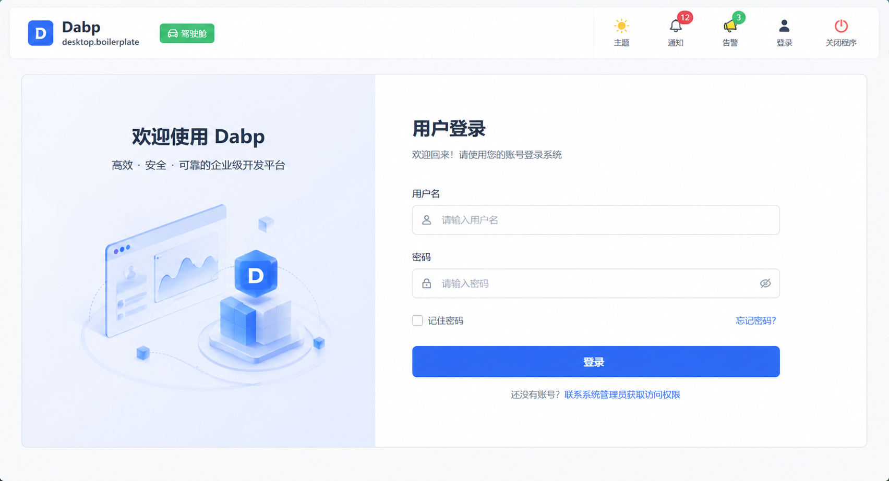

# Desktop Boilerplate (Dabp)

<p align="center">
  
</p>

[!\[CI Status\](https://github.com/yourorg/desktop.boilerplate/workflows/CI/badge.svg null)](https://github.com/yourorg/desktop.boilerplate/actions)
[!\[License\](https://img.shields.io/badge/license-MIT-blue.svg null)](LICENSE)

企业级WPF桌面应用框架 - 基于Prism + HandyControl，支持模块化插件架构，开箱即用。

## 特性

- **模块化架构** - 基于Prism 9的动态模块加载，支持插件化开发，模块间通过接口+事件解耦
- **完善的RBAC** - 用户-角色-权限三级权限管理，支持菜单/按钮/API三种权限类型，组织单位关联
- **现代化UI** - HandyControl 3.5组件库，支持Light/Dark主题切换，动态资源字典
- **丰富的扩展点** - 菜单（IMenuItemProvider）、仪表盘组件（IDashboardWidgetProvider）、报表（IReportGenerator）均可扩展
- **审计追踪** - 完整的操作审计日志，支持11种操作类型，持久化到数据库，支持Excel导出
- **会话安全** - 会话超时自动锁屏（可配置1-480分钟）、数据库断连自动锁屏、PBKDF2密码哈希
- **告警系统** - 多级别告警（Info/Warning/Critical），支持弹窗和声音提示，告警确认/解决/忽略生命周期管理
- **数据导出** - 支持CSV/Excel（ClosedXML）/PDF（QuestPDF）导出和CSV导入
- **通知系统** - 跨模块全局通知，支持5种通知类型和4级优先级，未读计数Badge
- **缓存服务** - 内存缓存（ConcurrentDictionary），支持模式匹配批量失效
- **分页查询** - 泛型分页查询（IPagedQuery<T>/PagedResult<T>），支持排序和过滤
- **配置管理** - appsettings.json + appsettings.local.json + 环境变量三层配置，运行时配置持久化
- **日志系统** - Serilog结构化日志，按日滚动，用户上下文自动注入
- **ID生成** - 基于Yitter的分布式雪花ID生成器

### 技术栈

| 分类 | 技术 | 版本 | 用途 |
|------|------|------|------|
| 框架 | .NET | 10 | 运行时 |
| UI框架 | WPF | net10.0-windows | 桌面界面 |
| MVVM框架 | Prism (Unity) | 9.0 | 模块化、导航、依赖注入、事件聚合 |
| 控件库 | HandyControl | 3.5 | WPF UI组件 |
| ORM | SqlSugar | 5.1.4 | CodeFirst数据库初始化、查询 |
| 日志 | Serilog | - | 结构化日志，文件滚动输出 |
| Excel | ClosedXML | - | Excel导出 |
| PDF | QuestPDF | - | PDF报表生成 |
| 加密 | BouncyCastle | - | PBKDF2密码哈希、SM4国密加解密 |
| ID生成 | Yitter.IdGenerator | - | 分布式雪花ID |
| 测试 | xUnit + Moq + FluentAssertions | - | 单元测试、Mock、断言 |

## 快速开始

### 前置要求

- .NET 10 SDK
- Visual Studio 2026+ 或 JetBrains Rider
- SQL Server 2019+（或使用LocalDB进行开发测试）

### 克隆和构建

```bash
git clone https://github.com/yourorg/desktop.boilerplate.git
cd desktop.boilerplate
dotnet restore
dotnet build
```

### 配置本地数据库

在 `src/Vk.Dbp.WpfWindow` 目录创建 `appsettings.local.json`：

```json
{
  "ConnectionStrings": {
    "Default": "Server=127.0.0.1;Database=DabpCore;Trusted_Connection=True;TrustServerCertificate=True;"
  }
}
```

运行应用后，SqlSugar CodeFirst 会自动创建数据库表并初始化种子数据。

### 默认账户

```text
用户名: admin
密码: 123456
```

> 首次登录后请立即修改默认密码。

📖 详细的配置说明请参阅 [快速开始指南](docs/wiki/Getting-Started.md)

## 项目结构

解决方案包含 **17个项目**，分层架构如下：

```
desktop.boilerplate/
├── src/                    # 核心源代码
│   ├── Vk.Dbp.WpfWindow/  #   Shell宿主（启动、布局、主题、导航）
│   ├── Vk.Dbp.Contracts/  #   契约层（接口、事件、扩展点）
│   ├── Vk.Dbp.Services/   #   通用服务（会话、审计、缓存、导出）
│   ├── Vk.Dbp.Infrastructure/ # 基础设施（实体、仓储、ORM）
│   ├── Vk.Dbp.Utils/      #   工具类（加密、ID生成、日志）
│   ├── Vk.Dbp.Domain/     #   领域模型（预留）
│   ├── Vk.Dbp.AdminWindow/ #  管理窗口
│   └── Vk.Dbp.Tools/      #   工具项目
├── prismModules/           # Prism业务模块
│   ├── Vk.Dbp.AccountModule/  # 账户管理（10视图、13VM、11服务）
│   └── Vk.Dbp.WorkshopModule/ # 车间示例（6视图）
├── dbpframework/           # 框架层
│   ├── Vk.Dbp.Core/       #   核心抽象
│   └── Vk.Dbp.Account/    #   账户原语
├── dbpApps/                # 客户应用入口
├── test/                   # 测试项目（54+单元测试）
├── scripts/                # PowerShell脚本
└── docs/                   # 文档
```

📖 完整的项目结构和架构说明请参阅 [架构指南](docs/wiki/Architecture.md)

## Wiki 文档索引

| 文档 | 说明 |
|------|------|
| [架构概览](docs/wiki/Architecture.md) | 分层架构、项目结构、技术栈、依赖规则 |
| [快速开始](docs/wiki/Getting-Started.md) | 环境配置、数据库设置、配置系统、环境变量 |
| [二次开发指南](docs/wiki/Module-Development.md) | 创建模块、核心服务使用、扩展点、事件系统、导航、主题 |
| [数据库 Schema](docs/wiki/Database-Schema.md) | 13张表结构、实体关系、种子数据 |
| [安全特性](docs/wiki/Security.md) | 密码安全、Token、SM4加密、会话安全、审计、告警 |
| [服务与运维](docs/wiki/Services-Guide.md) | 服务注册、日志系统、启动流程、脚本工具、测试、模块详解、代码规范 |

## 其他文档

| 文档 | 说明 |
|------|------|
| [模块开发指南](docs/MODULE_DEVELOPMENT_GUIDE.md) | 详细的模块开发教程和最佳实践 |
| [项目评审和路线图](docs/PROJECT_REVIEW_AND_TODO.md) | 项目现状分析和演进计划 |
| [本地配置说明](docs/LOCAL_CONFIGURATION.md) | 本地开发环境配置指南 |
| [登录会话指南](prismModules/Vk.Dbp.AccountModule/LOGIN_AND_SESSION_GUIDE.md) | 登录和会话管理API参考 |
| [贡献指南](CONTRIBUTING.md) | 开发流程、编码规范、PR规范 |
| [更新日志](CHANGELOG.md) | 版本变更记录和升级指南 |

## 贡献

欢迎贡献！请先阅读 [贡献指南](CONTRIBUTING.md)

## 许可证

MIT License - 详见 [LICENSE](LICENSE)

## 致谢

- [Prism](https://github.com/PrismLibrary/Prism) - MVVM和模块化框架
- [HandyControl](https://github.com/HandyOrg/HandyControl) - WPF控件库
- [SqlSugar](https://github.com/DotNetNext/SqlSugar) - ORM框架
- [Serilog](https://github.com/serilog/serilog) - 结构化日志框架
- [ClosedXML](https://github.com/ClosedXML/ClosedXML) - Excel读写库
- [QuestPDF](https://github.com/QuestPDF/QuestPDF) - PDF生成库
- [BouncyCastle](https://github.com/bcgit/bc-csharp) - 密码学库
- [Yitter.IdGenerator](https://github.com/yitter/IdGenerator) - 分布式雪花ID生成器
- [xUnit](https://github.com/xunit/xunit) / [Moq](https://github.com/moq/moq) / [FluentAssertions](https://github.com/fluentassertions/fluentassertions) - 测试框架
